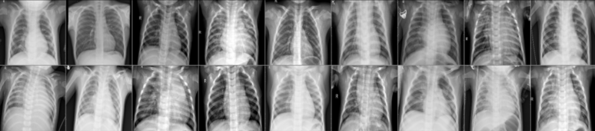

# Метод Transfer learing в задаче бинарной классификации рентгеновских снимков грудной клетки.

Возможность высокоточного и быстрого определения патологий на рентгеновских снимках грудной клетки позволяет на ранних стадиях обнаружить развитие пневмонии и приступить к незамедлительному лечению. Искусственный интеллект может позволить ускорить и качественно улучшить процедуру  рентгенологического анализа и давать рекомендации врачу для дополнительного рассмотрения подозрительных снимков.   Целью данного исследования является определение наилучших моделей и реализаций метода переноса обучения в задаче бинарной классификации при наличии малого объема тренировочных данных. В данном проекте рассмотрены различные способы аугментации исходных данных и подходы к обучению моделей ResNet и DanseNet для черно-белых рентгенологических изображений, выявлены те подходы, которые способствуют получению самых высоких результатов точности определения случаев пневмонии  и нормы на этапе тестирования. 

---
 В качестве данных для проведения исследований был взят датасет рентгеновских снимков с сайта Kaggle - ["Chest X-Ray Images Pneumonia"](https://www.kaggle.com/datasets/paultimothymooney/chest-xray-pneumonia)
 

  
  

 Рисунок - Пример изображений из датасета Chest X-Ray Images (Pneumonia) 
  
 
> Решение данного проекта представлено в формате трех идущих друг за другом jupiter ноутбуков + опубликованный препринт на платформе arXiv.org:
>1. Проведение предворительной обработки и аугментации изображений + создание кастомной сверточной сети - [Preprocessing_&_custom_DL_model.ipynb](https://github.com/Koldim2001/transfer_learning_CNN/blob/main/Preprocessing_%26_custom_DL_model.ipynb)
>2. Проведение экспериментов с transfer learning сети ResNet-18 - [Transfer_learning_ResNet.ipynb](https://github.com/Koldim2001/transfer_learning_CNN/blob/main/Transfer_learning_ResNet.ipynb)
>3. Проведение экспериментов с transfer learning сети DenseNet-121 - [Transfer_learning_DenseNet121.ipynb](https://github.com/Koldim2001/transfer_learning_CNN/blob/main/Transfer_learning_DenseNet121.ipynb)
> * Препринт ["Transfer learning method in the problem of binary classification of chest X-rays"]()
